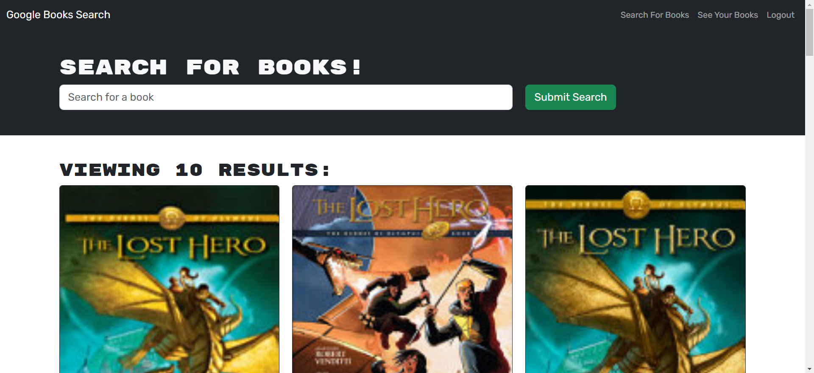

# book-search

## Description

Google Books API search engine built with a GraphQL API built with Apollo Server. The app was built using the MERN stack with a React front end, MongoDB database, and Node.js/Express.js server and API.

## Screenshot

## Link to Deployed Application

